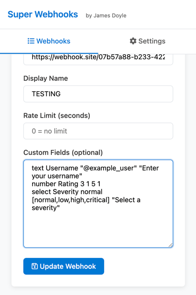
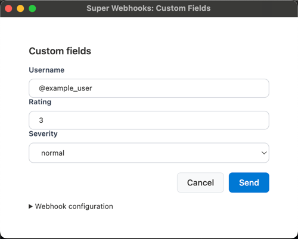

# Form DSL: A Simple Language for Dynamic Form Generation





A lightweight, human-readable Domain-Specific Language (DSL) for defining web form structures. This parser converts simple, single-line text commands into structured JSON objects, perfect for dynamically generating form components in a web application.

## ✨ Features

* **Human-Readable:** The syntax is clean, intuitive, and easy to write.
* **JSON Output:** Generates a clean array of JSON objects, ready to be used as props for your form components (e.g., in React, Vue, or Angular).
* **Extensible:** The parser can be easily extended to support new HTML input types and custom attributes.
* **Supports Common Inputs:** Out-of-the-box support for text, number, select, checkbox, radio groups, textarea, and more.
* **Comments:** Ignores lines starting with `#` for easy documentation within your DSL files.

## 🏛️ General Syntax

Each line in the DSL defines a single form field and generally follows this structure:

```bash
[input_type] [FieldName] [arguments...] "Label or Placeholder"
````

* `[input_type]`: The type of form field (e.g., `text`, `number`, `select`).
* `[FieldName]`: The name for the field. It will be converted to `camelCase` for the JSON `name` property and `Capitalized` for the `label`.
* `[arguments...]`: A series of optional values that configure the field, such as default values, min/max numbers, or select options. The order matters.
* `"Quoted Text"`: Used for placeholders, labels, or group labels depending on the field type.

## 📝 Example

Here is an example of the multi-line input:

```sh
# This is a comment. Lines starting with # are ignored.

# --- A basic group ---
text Username "@example_user" "Enter your username"
number Rating 3 1 5 1
select Severity normal [normal,low,high,critical] "Select a severity"

# A password field (works like text, but hides input)
password Secret "" "Enter a secure password"

# A url field
url Link "" "Enter a full url"

# A multi-line textarea
textarea Bio "I am a developer who loves creating..." "Tell us a bit about yourself"

# A checkbox (use 'true' or 'checked' for default state)
checkbox AgreeToTerms true "I agree to the terms and conditions"

# A radio button group
radio UserRole admin [guest,user,admin] "Select User Role"

# An HTML5 date picker
date StartDate 2025-10-26 "Select a project start date"

# An HTML5 range slider
range Volume 75 0 100 5 "Adjust Volume"

# An HTML5 color picker
color Theme #3b82f6 "Choose a theme color"

# A hidden field (won't be visible in the form)
hidden SessionID "abc-123-xyz"
```

And here is the output HTML for that example above:

```html
<form>
  <div>
    <label for="username-0">Username</label>
    <input type="text" name="username" id="username-0" placeholder="Enter your username" value="@example_user">
  </div>
  <div>
    <label for="rating-1">Rating </label>
    <input type="number" name="rating" id="rating-1" min="1" max="5" step="1" value="3">
  </div>
  <div>
    <label for="severity-2">Severity</label>
    <select name="severity" id="severity-2">
      <option value="" disabled="">Select a severity</option>
      <option value="normal" selected="">normal</option>
      <option value="low">low</option>
      <option value="high">high</option>
      <option value="critical">critical</option>
    </select>
  </div>
  <div>
    <label for="secret-3">Secret</label>
    <input type="password" name="secret" id="secret-3" placeholder="Enter a secure password" value="">
  </div>
  <div>
    <label for="bio-4">Bio</label>
    <textarea name="bio" id="bio-4" placeholder="Tell us a bit about yourself">I am a developer who loves creating...</textarea>
  </div>
  <div>
    <input type="checkbox" name="agreeToTerms" id="agreeToTerms-5" checked="">
    <label for="agreeToTerms-5">I agree to the terms and conditions</label>
  </div>
  <fieldset>
    <legend>Select User Role</legend>
    <div>
      <div>
        <input type="radio" id="userRole-6-guest" name="userRole" value="guest">
        <label for="userRole-6-guest">guest</label>
      </div>
      <div>
        <input type="radio" id="userRole-6-user" name="userRole" value="user">
        <label for="userRole-6-user">user</label>
      </div>
      <div>
        <input type="radio" id="userRole-6-admin" name="userRole" value="admin" checked="">
        <label for="userRole-6-admin">admin</label>
      </div>
    </div>
  </fieldset>
  <div>
    <label for="startDate-7">StartDate</label>
    <input type="date" name="startDate" id="startDate-7" placeholder="Select a project start date" value="2025-10-26">
  </div>
  <div>
    <label for="volume-8">Adjust Volume <span>75</span></label>
    <input type="range" name="volume" id="volume-8" min="0" max="100" step="5" value="75">
  </div>
  <div>
    <label for="theme-9">Theme</label>
    <input type="color" name="theme" id="theme-9" placeholder="Choose a theme color" value="#3b82f6">
  </div>
  <input type="hidden" name="sessionID" id="sessionID-10" value="">
  <button type="submit">Submit</button>
</form>
```

## 📝 Field Type Reference

Here are examples of all supported field types, along with their DSL syntax and corresponding JSON output.

### `text`

For standard single-line text inputs. Also works for `password`, `email`, `date`, `color`, and `hidden` types.

**DSL:**

```bash
text Username "@example_user" "Enter your username"
```

**JSON Output:**

```json
{
  "id": "username-0",
  "type": "text",
  "name": "username",
  "label": "Username",
  "defaultValue": "@example_user",
  "placeholder": "Enter your username"
}
```

### `textarea`

For multi-line text input.

**DSL:**

```bash
textarea Bio "I am a developer..." "Tell us about yourself"
```

**JSON Output:**

```json
{
  "id": "bio-1",
  "type": "textarea",
  "name": "bio",
  "label": "Bio",
  "defaultValue": "I am a developer...",
  "placeholder": "Tell us about yourself"
}
```

### `number`

For numeric inputs. Can also be used for `range` sliders.

**Syntax:** `number Name [default] [min] [max] [step]`

**DSL:**

```bash
number Rating 3 1 5 1
```

**JSON Output:**

```json
{
  "id": "rating-2",
  "type": "number",
  "name": "rating",
  "label": "Rating",
  "defaultValue": "3",
  "min": "1",
  "max": "5",
  "step": "1"
}
```

### `select`

For a dropdown menu.

**Syntax:** `select Name [default] [opt1,opt2,opt3] "placeholder"`

**DSL:**

```bash
select Severity normal [normal,low,high,critical] "Select a severity"
```

**JSON Output:**

```json
{
  "id": "severity-3",
  "type": "select",
  "name": "severity",
  "label": "Severity",
  "defaultValue": "normal",
  "options": [
    "normal",
    "low",
    "high",
    "critical"
  ],
  "placeholder": "Select a severity"
}
```

### `checkbox`

For a single checkbox.

**Syntax:** `checkbox Name [checked?] "label"`

**DSL:**

```bash
checkbox AgreeToTerms true "I agree to the terms and conditions"
```

**JSON Output:**

```json
{
  "id": "agreeToTerms-4",
  "type": "checkbox",
  "name": "agreeToTerms",
  "label": "I agree to the terms and conditions",
  "isChecked": true
}
```

### `radio`

For a group of radio buttons where only one can be selected.

**Syntax:** `radio Name [default] [opt1,opt2,opt3] "Group Label"`

**DSL:**

```bash
radio UserRole admin [guest,user,admin] "Select User Role"
```

**JSON Output:**

```json
{
  "id": "userRole-5",
  "type": "radioGroup",
  "name": "userRole",
  "label": "Select User Role",
  "options": [
    "guest",
    "user",
    "admin"
  ],
  "defaultValue": "admin"
}
```

## 🚀 How to Use

The core logic is contained within the `parseDslLine` function. To use this in your own project:

1.  **Integrate the Parser:** Copy the `parseDslLine` function into your project.
2.  **Process the Input:** Read your DSL text, split it by newlines, and map each line through the `parseDslLine` function.
3.  **Generate Components:** Use the resulting array of JSON objects to dynamically render your form fields.

<!-- end list -->

```javascript
const dslInput = `
text Name "" "Enter your full name"
email Address "" "your@email.com"
`;

const formProps = dslInput
    .split('\n')
    .filter(line => line.trim() && !line.trim().startsWith('#'))
    .map((line, index) => parseDslLine(line, index))
    .filter(Boolean);
// Now 'formProps' is an array of objects you can use to render your form.
```